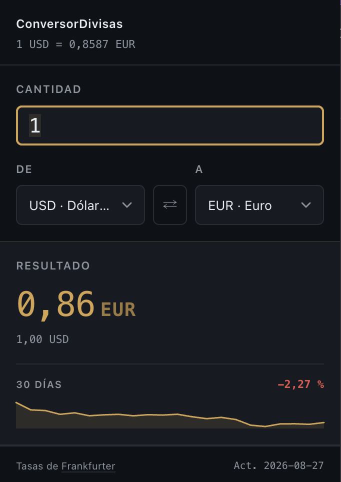

# ConversorDivisas

Extensión de Chrome para convertir divisas sin salir de lo que estés haciendo.

La hice porque me cansé de abrir una pestaña y buscar "euro a dólar" cada vez
que necesitaba una conversión rápida. Ahora es un clic en la barra del navegador.



## Qué hace

- Convierte entre 15 divisas con tasas del Banco Central Europeo
- Un botón para dar la vuelta al par sin tocar los dos desplegables
- Un pequeño gráfico con cómo ha ido la tasa en el último mes
- Recuerda la última pareja de divisas que usaste
- Se abre con `Ctrl+Shift+U` (en Mac, `Cmd+Shift+U`)
- Si algo falla te dice qué ha pasado, no se queda en blanco

Solo pide dos permisos: guardar tu última pareja de divisas y hablar con la API
de las tasas. No hay analítica ni seguimiento de ningún tipo.

## Instalación

No está en la Chrome Web Store, así que se carga a mano:

1. Descarga el repo (clonándolo o como ZIP)
2. Abre `chrome://extensions`
3. Activa el **Modo de desarrollador**, arriba a la derecha
4. Pulsa **Cargar descomprimida** y elige la carpeta del proyecto

El icono aparecerá en la barra. Si no lo ves, está escondido detrás del icono de
la pieza de puzzle.

¿El atajo no funciona? Chrome no lo asigna si ya lo está usando otra extensión.
Se cambia en `chrome://extensions/shortcuts`.

## Cómo está hecho

JavaScript a pelo: sin frameworks, sin build y sin dependencias. Son cuatro
archivos y una carpeta de iconos:

```
manifest.json    configuración de la extensión (Manifest V3)
popup.html       estructura del popup
popup.css        estilos
popup.js         toda la lógica
icons/           16, 48 y 128 px
```

No hay `package.json` ni `node_modules` porque no hacen falta. Editas un
archivo, le das a recargar en `chrome://extensions` y ya está.

Las tasas vienen de [Frankfurter](https://frankfurter.dev), que es gratuita, no
pide API key y saca los datos del BCE. Como el BCE publica una vez al día
laborable, el gráfico no tiene puntos en fines de semana ni festivos.

## Divisas soportadas

EUR, USD, GBP, JPY, CHF, CAD, AUD, CNY, MXN, BRL, SEK, NOK, DKK, PLN y TRY.

Para añadir otra basta con meter una línea en el array `CURRENCIES` de
`popup.js`, siempre que Frankfurter la soporte.

## Licencia

MIT. Haz lo que quieras con ello.
