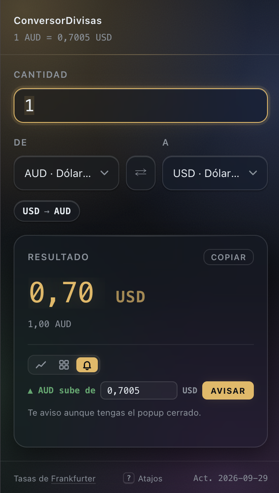

# ConversorDivisas

Extensión de Chrome para convertir divisas sin salir de lo que estés haciendo.

La hice porque me cansé de abrir una pestaña y buscar "euro a dólar" cada vez
que necesitaba una conversión rápida. Ahora es un clic en la barra del navegador.



## Qué hace

- Convierte entre las 30 divisas que publica el Banco Central Europeo
- Escribes en cualquiera de las dos cantidades y calcula la otra
- Puedes escribir una cuenta en vez de un número: `20+15`, `3*12,50`,
  `(40+60)/4` o `100-15%`. Mientras escribes te enseña el total, y al darle a
  Enter se queda con él
- Buscas la divisa escribiendo: pones "mex" y sale el peso mexicano
- Un botón para dar la vuelta al par sin tocar los dos desplegables
- Un botón para copiar el resultado
- La comisión de tu banco: pones el % que te cobra la tarjeta (0, 1, 2, 3 o el
  que quieras) y al lado del resultado sale lo que pagarías de verdad. Se queda
  guardada para la próxima vez
- Seleccionas un precio en cualquier web, clic derecho, **Convertir**, y te sale
  el resultado en una tarjeta al lado del texto. Entiende "1.299,00 €",
  "$1,049.99", "R$ 10,50" o "20 euros"
- Pastillas con tus últimos pares, para cambiar de uno a otro con un clic
- Un gráfico de cómo ha ido la tasa, a 7, 30 o 90 días. Pasando el ratón ves la
  tasa de cada día, y marca el máximo y el mínimo del periodo
- En la pestaña de al lado, la misma cantidad en otras divisas a la vez (hasta
  cinco, las eliges tú). Pulsando una la pones como destino
- Una chuleta de viaje en otra pestaña: 1, 5, 10, 20, 50 y 100 en las dos
  divisas, para mirar precios de un vistazo. Si la divisa es muy pequeña (yenes,
  rupias…) empieza en 100 o en 10.000, que si no la tabla no sirve. Pulsando una
  fila la pones como cantidad
- Recuerda la última pareja de divisas, el periodo del gráfico, la pestaña y
  las divisas que tienes puestas
- Guarda las tasas del día, así que al abrirlo ya está el número puesto
- La tasa de tu par en el propio icono de la barra, en verde si ha subido desde
  el día anterior, en rojo si ha bajado. Se actualiza cada hora; si no la
  quieres, clic derecho en el icono y la quitas
- Avisos de tasa: pones a cuánto quieres que llegue ("avísame si el dólar pasa
  de 1,15") y te salta una notificación cuando pase, aunque tengas el popup
  cerrado. Hasta cuatro a la vez
- Se abre con `Ctrl+Shift+U` (en Mac, `Cmd+Shift+U`)
- Atajos dentro del popup: `S` da la vuelta al par, `C` copia, `D` y `A` abren
  los desplegables y del `1` al `4` cambian de pestaña. Si estás escribiendo en
  un campo, con `Alt` delante (`⌥` en Mac). Con `?` salen todos
- Tiene modo claro y oscuro, según cómo tengas el sistema
- Si algo falla te dice qué ha pasado, no se queda en blanco

Pide lo justo: guardar tus preferencias, hablar con la API de las tasas, una
alarma para refrescar el icono y mirar los avisos cada hora, mandar las
notificaciones de esos avisos y, para lo del clic derecho, el menú y poner la
tarjeta en la pestaña en la que estás.
Esto último solo pasa cuando pulsas **Convertir**; no lee ninguna web por su
cuenta, y por eso Chrome no avisa de nada al instalarla. No hay analítica ni
seguimiento de ningún tipo.

En Mac, para ver los avisos Chrome necesita permiso para mandar notificaciones
(Ajustes del Sistema → Notificaciones → Google Chrome).

En las páginas donde Chrome no deja meter nada (las de `chrome://`, la Web Store
o el visor de PDF) se abre el popup con la cantidad ya puesta.

## Instalación

No está en la Chrome Web Store, así que se carga a mano:

1. Descarga el repo (clonándolo o como ZIP)
2. Abre `chrome://extensions`
3. Activa el **Modo de desarrollador**, arriba a la derecha
4. Pulsa **Cargar descomprimida** y elige la carpeta del proyecto

El icono aparecerá en la barra. Si no lo ves, está escondido detrás del icono de
la pieza de puzzle.

¿El atajo no funciona? Chrome no lo asigna si ya lo está usando otra extensión.
Se cambia en `chrome://extensions/shortcuts`.

## Cómo está hecho

JavaScript a pelo: sin frameworks, sin build y sin dependencias.

```
manifest.json    configuración de la extensión (Manifest V3)
popup.html       estructura del popup
popup.css        estilos
logica.js        las cuentas y los formatos, sin tocar la pantalla
popup.js         lo que reacciona a los clics
background.js    el menú del clic derecho y la tasa para la tarjeta
tarjeta.js       la tarjeta que sale en la web, en un shadow DOM
test/            tests de logica.js
icons/           16, 48 y 128 px
```

Lo que se puede probar solo está en `logica.js`, aparte del resto. Los tests van
con lo que ya trae Node, así que no hay `node_modules` que instalar:

```
npm test
```

Para lo demás, editas un archivo, le das a recargar en `chrome://extensions` y
ya está.

Las tasas vienen de [Frankfurter](https://frankfurter.dev), que es gratuita, no
pide API key y saca los datos del BCE. Como el BCE publica una vez al día
laborable, el gráfico no tiene puntos en fines de semana ni festivos, y las
tasas guardadas valen hasta el día siguiente.

## Divisas soportadas

Las 30 que publica el BCE. Primero las de siempre:

EUR, USD, GBP, JPY, CHF, CAD, AUD, CNY, MXN, BRL, SEK, NOK, DKK, PLN y TRY.

Y detrás el resto:

CZK, HKD, HUF, IDR, ILS, INR, ISK, KRW, MYR, NZD, PHP, RON, SGD, THB y ZAR.

Si el BCE añade alguna, basta con meter una línea en el array `CURRENCIES` de
`logica.js` (hay un test que comprueba que la lista es justo la del BCE, así
que habrá que tocarlo también). Para que la tarjeta del clic derecho la
reconozca por su símbolo o su nombre, va en `PISTAS`, en el mismo archivo.

## Licencia

MIT. Haz lo que quieras con ello.
